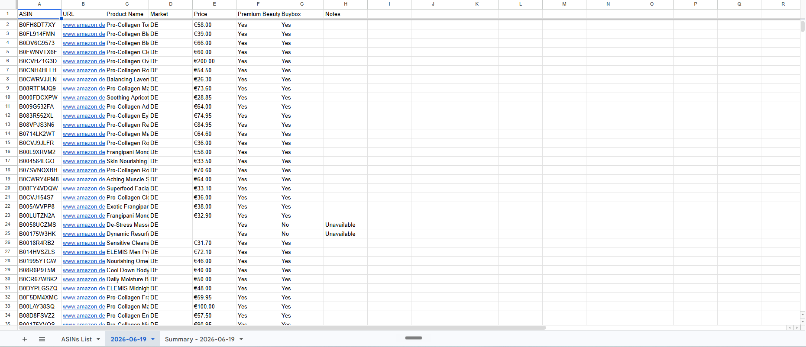
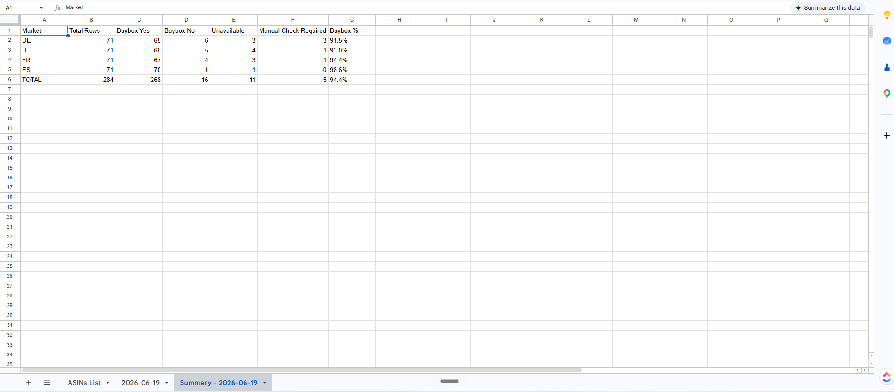

# Amazon Buybox Tracker

A production-grade automation that monitors Amazon Buybox ownership, pricing, and product availability across multiple EU marketplaces — built with Node.js, Playwright, and Google Sheets.

> Built for real-world use. Deployed to weekly production runs on a live client account.

---

## Table of Contents

- [Overview](#overview)
- [Features](#features)
- [Technical Stack](#technical-stack)
- [Architecture](#architecture)
- [Data Flow](#data-flow)
- [Key Engineering Decisions](#key-engineering-decisions)
- [Error Handling Strategy](#error-handling-strategy)
- [Example Output](#example-output)
- [Project Story](#project-story)
- [Challenges Solved](#challenges-solved)
- [Future Enhancements](#future-enhancements)
- [Lessons Learned](#lessons-learned)
- [Setup](#setup)
- [Screenshots](#screenshots)

---

## Overview

This automation reads a list of Amazon ASINs from a Google Sheet, scrapes each product detail page across four Amazon EU marketplaces (DE, IT, FR, ES), and writes structured results — including price, Buybox ownership, Premium Beauty badge status, and exception notes — back to the same Google Sheet.

A summary tab is generated alongside each run showing Buybox win rates, unavailable products, and items requiring manual review per marketplace.

Designed and deployed as a weekly scheduled automation using Windows Task Scheduler.

---

## Features

- **Multi-marketplace scraping** — Amazon DE, IT, FR, ES in a single run
- **Buybox ownership detection** — identifies whether Amazon holds the Buybox
- **Price extraction** — CSS selector fallback chain handles Amazon's varying DOM layouts
- **Premium Beauty badge detection** — multilingual, locale-aware text matching
- **Unavailable product detection** — multilingual phrases across all four markets
- **Amazon validation page recovery** — auto-detects and clicks through "Continue Shopping" gates
- **Retry logic** — 3 attempts per ASIN × market with 15-second back-off
- **Rate limiting** — 7-second inter-row delay to mimic human browsing and reduce bot detection
- **Debug artifact capture** — saves screenshot, full HTML, and body text on every failure
- **Google Sheets integration** — reads input, writes dated output tabs, generates summary tabs
- **Same-day re-run safety** — uniqueness guard prevents overwriting existing tabs
- **Test mode** — configurable ASIN limit for development and validation runs
- **Windows Task Scheduler** — weekly automated production execution

---

## Technical Stack

| Layer | Technology |
|---|---|
| Runtime | Node.js 18+ |
| Browser automation | Playwright (Chromium) |
| Sheets integration | Google Sheets API v4 via `googleapis` |
| Auth | Google OAuth2 (`google-auth-library`) |
| HTTP server (OAuth callback) | Express.js |
| Scheduling | Windows Task Scheduler |
| Language | JavaScript (CommonJS) |

---

## Architecture

```
┌─────────────────────────────────────────────────┐
│                  run.js (Orchestrator)          │
│                                                 │
│  1. Authenticate → Google Sheets API            │
│  2. Read ASINs from input sheet                 │
│  3. For each market × ASIN → scrapeWithRetries  │
│  4. Write output rows to dated sheet tab        │
│  5. Build and write summary tab                 │
└────────────────────┬────────────────────────────┘
                     │
                     ▼
┌─────────────────────────────────────────────────┐
│              scrape.js (Scraper)                │
│                                                 │
│  • Playwright persistent context per market     │
│  • Navigate → detect state → extract data       │
│  • Validation page → auto-recover               │
│  • Unavailable → return terminal state          │
│  • Failure → save debug artifacts               │
└────────────────────┬────────────────────────────┘
                     │
                     ▼
┌─────────────────────────────────────────────────┐
│         Persistent Browser Profiles             │
│  profile-DE  profile-IT  profile-FR  profile-ES │
│  (Amazon session + delivery region per market)  │
└─────────────────────────────────────────────────┘
```

See [docs/architecture.md](docs/architecture.md) for full component and data flow diagrams.

---

## Data Flow

```
Google Sheets (input)
  └─ Sheet1!A:B  ─────────────────────────┐
                                          ▼
                              for each market × ASIN
                                          │
                                          ▼
                                    scrape.js
                              ┌───────────┴────────────┐
                              ▼                        ▼
                         Happy path              Exception paths
                         ──────────               ───────────────
                         price                    Validation page
                         premiumBeauty            Page load fail
                         buybox (Yes/No)          Data not found
                         notes: ''                → debug saved
                              └───────────┬────────────┘
                                          ▼
Google Sheets (output)
  └─ [YYYY-MM-DD]!A:H     ──  per-ASIN output rows
  └─ [Summary - YYYY-MM-DD]  ──  per-market Buybox %
```

---

## Key Engineering Decisions

### Persistent Browser Profiles Per Marketplace
Each Amazon domain gets its own Playwright persistent context, pre-warmed with the correct delivery country. Without this, Amazon defaults the delivery region to the machine's locale — rendering EU pricing and availability data completely unreliable.

### CSS Selector Fallback Chain
`getPrice()` tries six selectors before returning empty. Amazon's DOM varies by product type, A/B test variant, and marketplace. A fallback chain is significantly more resilient than a single selector.

### Multilingual Text Detection
All detection functions check for phrases in all four supported languages. Amazon's text content is more reliably present than its CSS class names or structured data attributes across locales.

### `isBadResult` Excludes Unavailable State from Retries
"Unavailable" is a confirmed business state, not a scrape failure. Retrying it wastes time and adds load. This distinction matters for the summary sheet's accuracy.

### Structured Notes Vocabulary
Notes use a fixed vocabulary (`Unavailable`, `Manual Check Required - [reason]`, blank). This makes the output filterable, allows summary aggregation, and prevents free-form errors from polluting downstream reporting.

See [docs/project-decisions.md](docs/project-decisions.md) for the full decision log with rationale.

---

## Error Handling Strategy

The scraper handles four distinct failure modes, each with a different response:

| Failure Mode | Detection | Response |
|---|---|---|
| Amazon validation / CAPTCHA page | Text + HTML pattern matching (multilingual) | Auto-click recovery button, re-navigate, re-scrape |
| Product unavailable | Text pattern matching (multilingual) | Return terminal `Unavailable` state — no retry |
| Page load timeout / network error | Playwright exception catch | Save debug artifacts, retry up to 3× |
| Data present but unextractable | Empty price + empty sellerText | Save debug artifacts, retry up to 3× |

After exhausting retries, rows are written with `Manual Check Required — [specific reason]` in the Notes column, so a human reviewer knows exactly why the row needs attention.

**Debug artifacts** (screenshot, HTML, body text) are saved on every failure with timestamps and reasons in the filename — enabling post-hoc diagnosis without re-running the scraper.

---

## Example Output

### Output Tab (per run)

| ASIN | URL | Product Name | Market | Price | Premium Beauty | Buybox | Notes |
|---|---|---|---|---|---|---|---|
| B08XYZ123 | www.amazon.de/dp/B08XYZ123 | Example Serum 50ml | DE | €42,99 | Yes | Yes | |
| B08XYZ123 | www.amazon.it/dp/B08XYZ123 | Example Serum 50ml | IT | | No | No | Unavailable |
| B08XYZ456 | www.amazon.fr/dp/B08XYZ456 | Example Cream 100ml | FR | €38,50 | No | No | |
| B08XYZ789 | www.amazon.es/dp/B08XYZ789 | Example Toner 150ml | ES | | No | No | Manual Check Required - Amazon Validation Page |

### Summary Tab (per run)

| Market | Total Rows | Buybox Yes | Buybox No | Unavailable | Manual Check Required | Buybox % |
|---|---|---|---|---|---|---|
| DE | 25 | 22 | 3 | 0 | 1 | 88.0% |
| IT | 25 | 18 | 5 | 2 | 0 | 72.0% |
| FR | 25 | 20 | 3 | 1 | 1 | 80.0% |
| ES | 25 | 19 | 4 | 2 | 0 | 76.0% |
| **TOTAL** | **100** | **79** | **15** | **5** | **2** | **79.0%** |

---

## Screenshots

### Output Tab


### Summary Tab


---

## Project Story

### Why It Was Built

The manual process for monitoring Buybox ownership across four Amazon EU marketplaces required a team member to open dozens of product pages one by one, check prices, look for the Prime/Buybox indicator, and log results into a spreadsheet. For a meaningful ASIN list, this took several hours per week and was error-prone.

The goal was to automate this entirely: read ASINs from a shared sheet, check every PDP programmatically, and write clean, structured results back — without anyone having to open a browser.

### Problems Encountered

**Amazon's anti-bot defences** were the first major challenge. Initial runs triggered "Continue Shopping" validation gates frequently. The solution combined persistent browser profiles (to carry established session state), a 7-second delay between requests (to mimic human browsing pace), and automatic detection and recovery logic for validation pages.

**Delivery region contamination** caused an entire marketplace's data to be wrong. When a browser profile had the wrong delivery country, Amazon would show unavailability or incorrect pricing for all products. Persistent per-marketplace profiles with manual warmup solved this.

**DOM inconsistency** across Amazon's A/B test variants and product types meant a single CSS selector would extract price for 90% of products but silently fail for the rest. A six-selector fallback chain with debug capture on failure solved this iteratively — each new failure mode added a new selector.

**Multilingual detection** required understanding how Amazon expresses "unavailable", "Premium Beauty", and validation page phrases in German, Italian, French, and Spanish — and encoding all variants in the detection functions.

### Reliability Improvements Over Time

- Added retry loop with back-off (reduced manual check rate significantly)
- Added validation page auto-recovery (further reduced manual check rate)
- Added `isBadResult` logic to distinguish real failures from unavailable products
- Added same-day re-run safety to prevent data loss on interrupted runs
- Added structured Notes vocabulary to make the output auditable

---

## Challenges Solved

| Challenge | Solution |
|---|---|
| Amazon bot detection | Persistent profiles + 7s delays + validation page recovery |
| Delivery region correctness | Per-marketplace persistent Playwright profiles |
| DOM inconsistency | CSS selector fallback chain + debug capture |
| Multilingual page content | Language-aware text detection for all four locales |
| Transient failures | 3-attempt retry with 15s back-off |
| Post-failure diagnosis | Debug artifacts: screenshot + HTML + body text per failure |
| Re-run safety | Sheet uniqueness guard with `(N)` suffix |
| Cloud scheduling limitations | Windows Task Scheduler — no infrastructure required |

---

## Future Enhancements

- **Email notifications** — success summary and failure alerts after each run
- **Threshold alerts** — notify when Manual Check Required count exceeds a threshold
- **Historical tracking** — week-over-week Buybox % trend sheet
- **Price change tracking** — delta column showing price movement from previous run
- **Buybox change tracking** — flag ASINs where Buybox changed hands since last run
- **Server hosting** — move to a cloud VM to remove dependency on a local machine being awake
- **Additional marketplaces** — NL, SE, PL (minor config additions)
- **Slack/Teams webhook** — post summary to a channel on completion

---

## Lessons Learned

- **Persistent browser sessions are essential for locale-sensitive scraping.** Without a pre-warmed profile, the delivery region assumption invalidates the entire dataset.
- **Debug artifacts are not optional.** Being able to look at the exact page state at the moment of failure — without re-running the scraper — was the single most valuable diagnostic tool during development.
- **Fixed output vocabularies matter.** Structured, predictable Notes values make reporting automation possible downstream and make manual review faster.
- **Cloud orchestration is not always the right answer.** Windows Task Scheduler was simpler, cheaper, and more reliable for this use case than standing up a cloud workflow platform that couldn't natively run a local Playwright session.
- **7 seconds feels slow until you see what happens without it.** Rate limiting is not optional when scraping at scale.

---

## Setup

See [docs/setup-guide.md](docs/setup-guide.md) for complete setup instructions.

Quick start:

```bash
git clone https://github.com/YOUR_USERNAME/amazon-buybox-tracker.git
cd amazon-buybox-tracker
npm install
npx playwright install chromium
# Add credentials.json and follow setup guide
node run.js
```

---

## Security

The following files must never be committed to version control:

| File | Reason |
|---|---|
| `credentials.json` | Google OAuth2 client credentials |
| `token.json` | OAuth2 access and refresh tokens |
| `profiles/` | Browser profiles containing session cookies |
| `debug/` | May contain PII from scraped pages |

All are excluded via `.gitignore`. See [docs/setup-guide.md](docs/setup-guide.md) for how to create these files locally.

---

## License

MIT — see [LICENSE](LICENSE) file.
